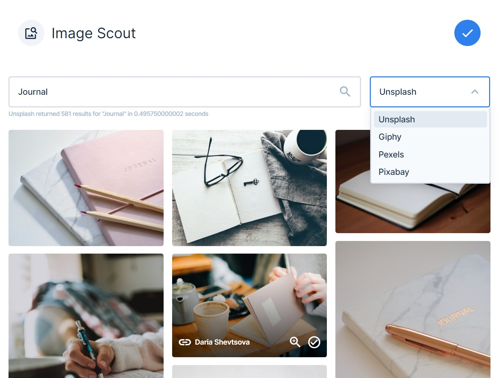

# Image Scout

> v3.0.0 Tested On Directus 9.18.1

## What is Image Scout?

Image Scout is an interface extension for Directus 9 developed by Resauce. A clean interface is provided allowing you to search multiple online image libraries to find images that suit your needs. When a provider is configured, the connection should be seamless, allowing you to easily find and use the image that you want or need in your project.

### Here's what image-scout looks like!

## Install & Get Started

Copy the folders from this repository's `dist` directory into your extensions folder
- `/extensions/interfaces/resauce-image-scout
- `/extensions/endpoints/resauce-image-scout

To enable providers for your users to use:
- Decide what providers you want to use and register for an API Key
- Configure the below providers as required
- Restart your Directus instance
- The configured providers will now be available on the frontend

### Envrionment Variables

| Env Example | Default Value | Security URL | Description |
| ----------- | ------------- | ----- | ----------- |
| API_KEY_UNSPLASH | `NULL` | https://images.unsplash.com | The key you configured to use the Unsplash API |
| API_KEY_PEXELS   | `NULL` | https://images.pexels.com | The key you configured to use the Pexels API |
| API_KEY_PIXABAY  | `NULL` | https://pixabay.com | The key you configured to use the Pixabay API |
| API_KEY_GIPHY    | `NULL` | https://*.giphy.com | The key you configured to use the Giphy API |
| RIS_DEFAULT_PROVIDER | `NULL` | - | The key of the provider you would like as your default selection |
| RIS_REQUIRED_AUTH | `TRUE` | - | Is direcus authentication required to use this API externally? |

### Configuring URLs

Due to the Content-Security-Policy that Directus uses through the Helmet system, you will need to whitelist the URLs that the images will come from.

This means you will need to add the below configuration to your environment file, you can omit any URLs that you don't have configured.

`CONTENT_SECURITY_POLICY_DIRECTIVES__IMG_SRC="'self' data: blob: https://cdn.directus.io https://images.unsplash.com https://images.pexels.com https://pixabay.com https://*.giphy.com"`

## Interface Usage & Collection Usage

To enable Image Scout as field in your application, follow this guide:

1. Edit collection where you would like to enable Image Scout
2. Create a new field for: `Image`
3. Name the column whatever you'd like (feature_image?)
4. Fill out any of the other fields of your own accord
5. Click "**Continue in Advanced Field Creation Mode**"
6. Open "Interface"
7. Deselect "Image" as the selected interface
8. Select "Image Scout" as your interface
6. Open "Display", and select `Image` as the display.

## Learn More — What's a provider?

A provider is an online service that allows you to view and download images for use in your own project. The providers we have are listed below, to enable them, you must register an API key with the service then store that key in your Envrionment File.

If you have multiple providers enabled, you can decide which provider you would like to be the default provider by setting the `RIS_DEFAULT_PROVIDER` in your envrionemnt file

### Pixabay

Provider Key: `PIXABAY`

Directus ENV Configuration Key: `API_KEY_PIXABAY`

API Registration: https://pixabay.com/api/docs/

### Unsplash

Provider Key: `UNSPLASH`

Directus ENV Configuration Key: `API_KEY_UNSPLASH`

API Registration: https://unsplash.com/developers

### Giphy

Provider Key: `GIPHY`

Directus ENV Configuration Key: `API_KEY_GIPHY`

API Registration: https://developers.giphy.com/docs/api/

### Pexels

Provider Key: `PEXELS`

Directus ENV Configuration Key: `API_KEY_PEXELS`

API Registration: https://www.pexels.com/api/

> Note: An approved account will be required to be able to download high-res images. Please have your account approved otherwise you may not be able to download images.

## Common Issues

I've come across a few issues, here's the issues and how to fix them.

### 🎨 Failed to import image

This error usually comes along with ECONNREFUSED and a 500 status request to `/resauce-image-scout/providers/<provider>/download`

This happens when you are loading the app from a different URL to the one configured in your `HOST` entry in your `.env` file

### Refused to load the image '<URL>' because it violates the following Content Security Policy directive

This occurs when you've failed to configure the URL in the `CONTENT_SECURITY_POLICY_DIRECTIVES__IMG_SRC` variable required further up the documentation.

## Liability

Before activating any provider, ensure you have agreed to their terms and usage policy. You are subject to their usage terms based on how you use these images. No contributor to this repository accepts responsibility for the use of the images.
